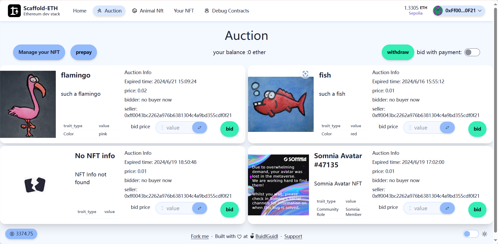

# 🔨Auction

<h4 align="center">
  <a href="https://github.com/dogcar969/auction-graph">The graph part</a> |
  <a href="https://auction-ri0erc2on-dog-cars-projects.vercel.app/nfts">Website</a>
</h4>

A NFT Auction Dapp on the Ethereum blockchain. It's designed to auction NFT with time limit. An adjunct Animal NFT dapp for test is also available.

⚙️ Built using The Graph, NextJS, RainbowKit, Hardhat, Wagmi, Viem,DaisyUI and Typescript.

- ✅ **[On-chain data analysis](https://github.com/dogcar969/auction-graph)**: Use The Graph to analyse events and function calls.The result is existed listings and records about Animal NFT requested and minted.
- **[Chainlink VRF ](https://dev.chain.link/products/vrf)**: Use Chainlink VRF to control the rarity of NFT
- **Exception handle**: Handle special circumstances that NFT has been transfered or disapproved before auction closed.
- **[High unit test coverage](https://github.com/dogcar969/Auction-scaffold/tree/main/packages/hardhat/test)**: Coverage rate of lines tested is 96.1% for Auction and 90.24% for Animal NFT. Only function implementation required by openzepplin,fallback function,getter and eth transfer error handler is not covered.
- 📇**Reusable nft card component**: Create a nft card component and wrap it with buttons or informations according to demands.

## Smart Contract:

[_Path:packages/hardhat_](https://github.com/dogcar969/Auction-scaffold/tree/main/packages/hardhat)

### [AnimalNFT](https://sepolia.etherscan.io/address/0x2F4cD2Dad9C14d3918616C3745c51320b81cad1f)

User can request nft. And after VRF filled, nft will be minted according to the random word and value transfered.
The probabilities are showed below.
|value|species|probability|
|-|-|-|
|>=minFee & <threshold|fish|(threshold-value)/(threshold-minFee)|
|>=minFee & <threshold|flamingo|(value-minFee)/(threshold-minFee)|
|>=threshold|flamingo|99%|
|>=threshold|godzilla|1%|

#### Features:

1. Use pinata to upload jsons and images.
2. Use pinata gateway to fetch json and images.
3. Use openzepplin contracts for implementing basic nft functions.
4. Use chainlink VRF to determine the kind of nft to be minted.
5. Use mock contracts for unit test.

### [Auction](https://sepolia.etherscan.io/address/0x012f0d2831a175976a21d714fedf077cf26cc3e8)

User can auction or bid nfts.
If anyone bid in limited time,the time will be refreshed.And if it's due and someone checked it,it will be sold to the highest bidder or pass if no one bid.
User need to deposit eth to bid.and if they are not the highest bidder,the money will return to their balance.

#### Features:

1. Use internal function to handle with sold and pass.
2. User can choose to bid with eth sent or bid with their balance.
3. Handle the circumstances below
   - Nft transfered before auction closed.
   - Nft approval canceled before auction closed.

## [Frontend:](https://auction-lyart.vercel.app/)

[_path:packages/nextjs_](https://github.com/dogcar969/Auction-scaffold/tree/main/packages/nextjs)

### AnimalNFT

[mint page:](https://auction-lyart.vercel.app/AnimalNft)

User can mint and get nfts.

As VRF fulfil spends too much time, there is no loading dialog.
User can see their request record right after he or she requests nft.
User can come back later,get minted nft in the record.
Click the view button.a modal contains information of the nft is open.

[nfts page:](https://auction-lyart.vercel.app/nfts)

User can interact with nfts they owned.

User can approve or transfer nft.
A basic pagination is implemented.
It's hard to know the maximum page count as the graph doesn't have the function to get count of entities.

**Features:**

1. All NFT informations are fetched from pinata.
2. Nfts user owned are stored on The Graph.

### Auction

[Auction page:](https://auction-lyart.vercel.app/Auction)
User can bid in for listed NFT.

User can preview,approve,auction,check or cancel their NFT in the dialog

User can prepay or withdraw. and a toggle changes between bid with eth sent and bid without eth sent

**Features:**

1. Support for IPFS link and https link
   - Change IPFS link to IPFS public gateway link(ipfs.io).
2. Preview function in order to make sure it's the correct NFT to be operated.
   

**_Filtering listing that's not expired is feasible._**
**_But to show the result,it's necessary to leave the expired NFTs._**
